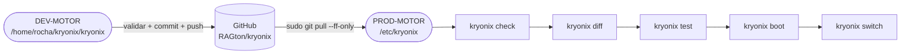

# DEV / PROD Flow

Referência arquitetural. Conteúdo operacional vive em
[[Safe Git Workflow]] (mais comandos) e em [[DECISIONS]] D-001.

## Mapa

```txt
/home/rocha/kryonix/             DEV
├── kryonix/                     DEV-MOTOR     ↔ origin RAGton/kryonix
└── kryonixos/                   DEV-SITE      ↔ origin RAGton/Kryonixos

/etc/kryonix/                    PROD-MOTOR
/etc/kryonixos/                  PROD-SITE
```

## Ciclo



## Matriz de permissões

Ver [[Safe Git Workflow]] ou [[02-Areas/Kryonix/kryonix-meta/CURRENT_STATE]].

## Implementação

- CLI: `kryonix env [status]`, `kryonix update` split DEV/PROD,
  `kryonix pull --ff-only`. Implementado em PR #62.
- Skills: [[02-Areas/Kryonix/operations/Safe Git Workflow]] e
  `docs/operations/GIT_DEV_PROD_WORKFLOW.md`.

Tags: #kryonix #dev-prod #governança


## Links relacionados

- [[01-MOCs/Mapa - Kryonix]]