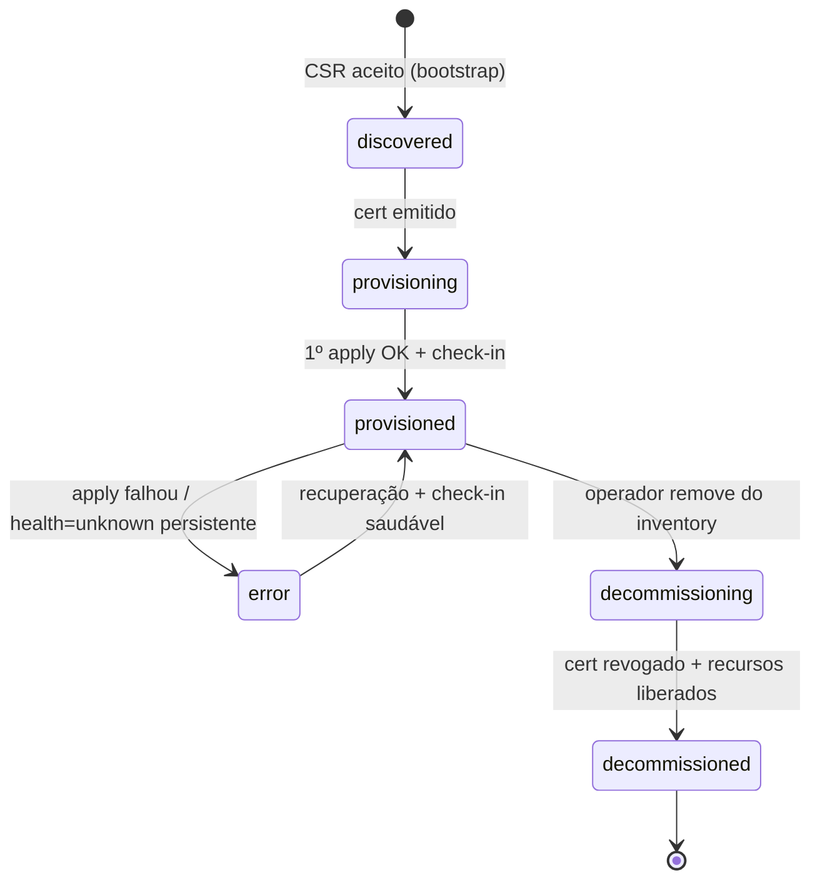

# Kryonix Architecture - Overview

<role>
Atuando como Arquiteto Sênior para definir a topologia e os fluxos de integração entre os 10 subsistemas do ecossistema Kryonix.
</role>

## Resumo
Esta nota descreve a arquitetura distribuída do Kryonix, focando em como os subsistemas interagem utilizando o `[[02-Areas/Kryonix/canonical/Kryonix Entity Schema]]` como contrato de verdade. As duas seções centrais detalham o **fluxo de mTLS** (como um host nasce, prova identidade e troca estado com o `ai-brain`) e o **decaimento de estados** (como a saúde de um host degrada na ausência de check-in).

## Conexões Estratégicas
- **Hub Central:** [[01-MOCs/Mapa - Kryonix]]
- **Contrato de Dados:** [[02-Areas/Kryonix/canonical/Kryonix Entity Schema]]
- **Implementação Física:** [[02-Areas/Kryonix/hosts/Kryonix Host Inventory]]
- **Modelo de Segurança:** [[02-Areas/Kryonix/architecture/Security Model]]

---

<facts>
- A comunicação entre o `ai-brain` e os `hosts` é baseada em Pull-model via mTLS.
- O estado desejado (Desired State) é definido de forma declarativa via NixOS Flakes.
- O `canonical-schema` (v1.0.0) é a única fonte de verdade para serialização de eventos.
- Cada host tem identidade criptográfica derivada de um par de chaves gerado no provisionamento e selado em TPM2/age.
- O estado de saúde (`HostState.health`) é uma função do `last_checkin`: não é gravado manualmente, é **derivado** pela passagem do tempo.
</facts>

## Ciclo de Vida da Operação (TOON)

```toon
fase,               descrição,                                  subsistema_líder
provisionamento,    boot via PXE/ISO e escrita via disko,       installer
identidade,         geração de chaves e registro no brain,      hosts / ai-brain
configuração,       aplicação de nix-flakes e systemd units,    systems / canonical
observabilidade,    coleta de métricas e logs via vetores,      operations
evolução,           atualização de firmware e software,         ai-brain / systems
```

---

## 1. Fluxo de mTLS (Identidade e Pull de Estado)

O Kryonix **não usa SSH direto** para orquestração. Cada host roda um *agent* que faz **pull** do estado desejado a partir do `ai-brain`, sobre um canal mTLS onde **ambos os lados apresentam certificado**. A CA interna vive no `ai-brain` (control plane).

### 1.1 Bootstrap (primeira identidade)

```mermaid
sequenceDiagram
    participant ISO as Installer (ISO/Kiosk)
    participant Host as Host Agent
    participant Brain as ai-brain (CA + Inventory)

    ISO->>Host: provisiona disko + nixos-install + token bootstrap (one-time)
    Host->>Host: gera keypair (selado em TPM2/age)
    Host->>Brain: CSR + bootstrap-token (canal TLS server-auth)
    Brain->>Brain: valida token, cria entity Host (status=discovered)
    Brain-->>Host: cert assinado pela CA (curta duração, ~24h)
    Host->>Host: armazena cert; status=provisioning
    Host->>Brain: 1º check-in mTLS (cliente+servidor autenticados)
    Brain-->>Host: Desired State (nix flake ref) ; status=provisioned
```

### 1.2 Regime permanente (steady-state pull)

```toon
passo, ator,   ação,                                                  validação_no_brain
1,     host,   abre conexão mTLS e apresenta cert do host,            cert assinado pela CA + não revogado
2,     brain,  apresenta cert do servidor,                            host valida contra CA pinada
3,     host,   GET /desired-state?host=<uuid>,                        host existe no inventory + status≠decommissioned
4,     brain,  responde flake ref + generation alvo,                  —
5,     host,   aplica nix switch e reporta resultado (check-in),      atualiza last_checkin + health
```

<facts>
- Certificados são **curta-duração** (TTL ~24h) e renovados pelo próprio agent antes de expirar (renovação proativa em ~⅔ do TTL).
- A revogação é imediata: remover o host do inventory ou marcá-lo `decommissioning` corta o acesso na próxima conexão.
- O `bootstrap-token` é one-time e expira; não serve para reautenticação.
</facts>

<best_practices>
- **mTLS em vez de SSH:** resiliente a NAT/firewall (host inicia a conexão de saída) e auditável por design.
- **Fail-Fast Registration:** se um host não valida contra o `Entity Schema` ou contra a CA, é isolado imediatamente.
- **Audit-Log Everywhere:** toda mudança de estado iniciada pelo `ai-brain` gera uma `Issue` (Entity: Issue).
- **Cert curto + renovação proativa:** janela de comprometimento mínima; revogação efetiva sem CRL pesada.
</best_practices>

---

## 2. Decaimento de Estados (State Decay)

A saúde do host **decai com o tempo** quando o check-in para de chegar. Em vez de um cron que "marca offline", o `health` é computado a cada leitura como função de `now - last_checkin`. Isso casa diretamente com os enums de `HostState` no [[02-Areas/Kryonix/canonical/Kryonix Entity Schema]].

### 2.1 Decaimento de `health` por idade do check-in

```toon
health,     condição (idade do last_checkin),        gatilho_de_ação
healthy,    < 1× intervalo (ex: < 30s),               nenhuma
degraded,   1×–4× intervalo (30s–2min),               alerta soft; re-tenta pull
unhealthy,  4×–20× intervalo (2min–10min),            alerta hard; marca para inspeção
unknown,    > 20× intervalo (>10min) OU cert expirado, considera host perdido; bloqueia novo Desired State
```

> O intervalo base vem de `Service.health.interval_sec` / política do host. O decaimento é **monotônico**: sem check-in novo, o estado só piora.

### 2.2 Ciclo de vida de `status` (lifecycle)



<facts>
- `status` e `health` são ortogonais: um host `provisioned` pode estar `unhealthy` (vivo no inventário, mas sem check-in recente).
- Transição `provisioned → error` é disparada quando `health=unknown` persiste além do limite OU o `nix switch` falha.
- Um host em `unknown` por cert expirado **não recebe novo Desired State** até reautenticar (volta ao fluxo de renovação ou novo bootstrap).
</facts>

---

## Topologia de Integração

A arquitetura é dividida em três camadas principais:

1. **Camada de Orquestração (Control Plane):**
   - **ai-brain:** Coordena decisões, hospeda a CA interna e gerencia o repositório de estados.
   - **kryonix-meta:** Contém as políticas globais e o Roadmap.

2. **Camada de Serviço (Data Plane):**
   - **systems / architecture:** Define os templates de serviço e o hardening.
   - **canonical:** Garante a validade das mensagens trafegadas (Entity Schema v1.0.0).

3. **Camada de Execução (Edge/Node):**
   - **hosts / installer:** Onde o hardware encontra o código (Glacier = main, Inspiron = edge/field).
   - **branding:** Define a interface de interação humana (CLI/Web/Kiosk).

<opinion>
Devemos evitar o uso de SSH direto para orquestração. O modelo "Agent-based Pull" (onde o host consulta o Brain) é mais resiliente a falhas de rede e facilita o gerenciamento de frotas atrás de NAT/Firewalls complexos. O decaimento derivado de `last_checkin` é preferível a flags persistidas porque é à prova de "estado preso" — um host que sumiu nunca fica eternamente `healthy`.
</opinion>

<risks>
- **Single Point of Failure:** o `ai-brain` (e a CA) precisa de alta disponibilidade; sua queda paralisa provisionamento e renovação de certs.
- **Drift de Esquema:** mudanças no `canonical` sem retrocompatibilidade podem "brickar" instâncias antigas do `installer`.
- **Clock skew:** decaimento e expiração de cert dependem de relógio confiável (NTP). Skew grande gera falsos `unknown` ou certs aceitos indevidamente.
- **Tempestade de renovação:** se muitos hosts renovarem no mesmo instante, a CA vira gargalo — distribuir jitter na renovação proativa.
</risks>

---

## Procedimento de Validação
- [ ] Executar teste de integração: criar uma entidade `Host` fake e verificar se o `ai-brain` a processa corretamente.
- [ ] Validar fluxo de `Command`: enviar um comando via schema e verificar se o `systems` o interpreta.
- [ ] Simular perda de check-in e confirmar a transição `healthy → degraded → unhealthy → unknown` nos limiares definidos.
- [ ] Forçar expiração de cert e confirmar bloqueio de Desired State até reautenticação.

## Próxima ação
- [x] Detalhar o fluxo de mTLS (bootstrap + steady-state).
- [x] Detalhar o decaimento de estados (health + lifecycle).
- [ ] Detalhar o fluxo de mTLS no subsistema `operations` (telemetria sobre o mesmo canal).
- [ ] Vincular o limiar de decaimento à política por-role no [[02-Areas/Kryonix/hosts/Kryonix Host Inventory]].
